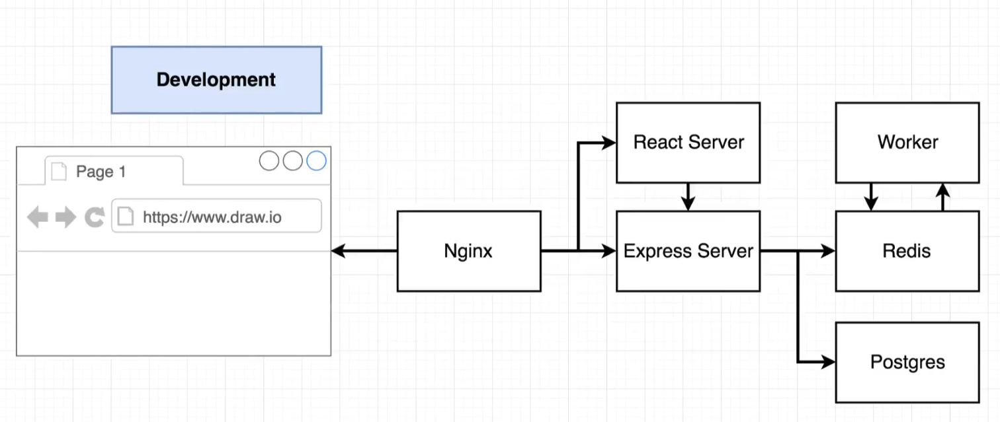
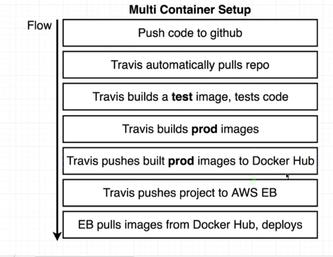

# CI / CD with Docker

The content of this repository is derived the course ["Docker and Kubernetes: The Complete Guide"](https://www.udemy.com/course/docker-and-kubernetes-the-complete-guide/).

### Overview of the Services

### Flow

